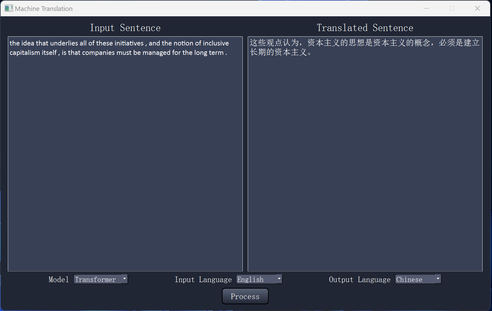

# Machine Translation with Transformer

This project aims to preform Machine Translation (English to Chinese) using Transformer Trained from Scratch. (GUI included)


### Dataset: 
[Kaggle machine translation](https://www.kaggle.com/code/concyclics/machine-translation-between-chinese-and-english/)
	

### Build: 

	CPU: Intel i9-13900H (14 cores)
	GPU: NVIDIA RTX 4060 (VRAM 8 GB)
	RAM: 32 GB


### Python Packages:

	conda install pytorch==2.1.2 torchvision==0.16.2 torchaudio==2.1.2 pytorch-cuda=12.1 -c pytorch -c nvidia
	conda install -c conda-forge pytorch = 2.1.2
	conda install -c conda-forge pandas = 1.5.3
	conda install -c conda-forge tqdm = 4.64.1
	conda install -c conda-forge nltk = 3.8.1
	conda install -c conda-forge matplotlib = 3.8.0
	conda install -c conda-forge numpy = 1.26.4
		
		
		
### Training Curves

<p align="center">
  
  
</p>
		


### Code Structure:
```bash
├── GUI.py (Run to generate a GUI)
├── main.py (Run to train model)
├── Transformer.py
├── qt_main.py
├── training.py
├── visualization.py
├── summary.py
├── tokenizer.py
├── vocab.pkl

```


### Credits:
	https://github.com/openai/gpt-2/blob/master/src/encoder.py
	Attention is all you need
	